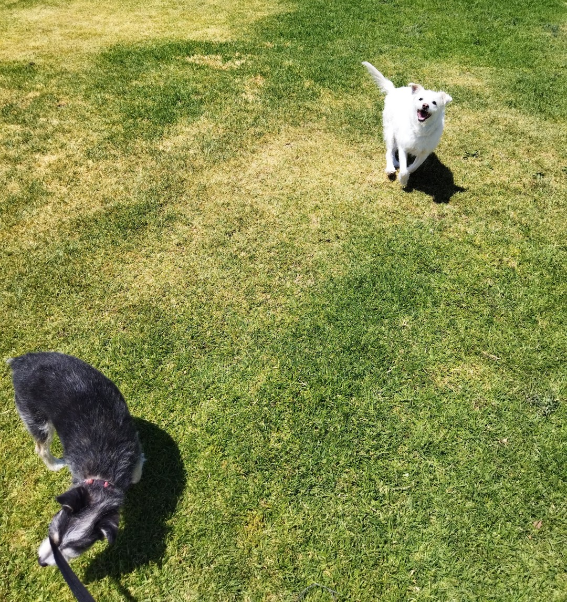
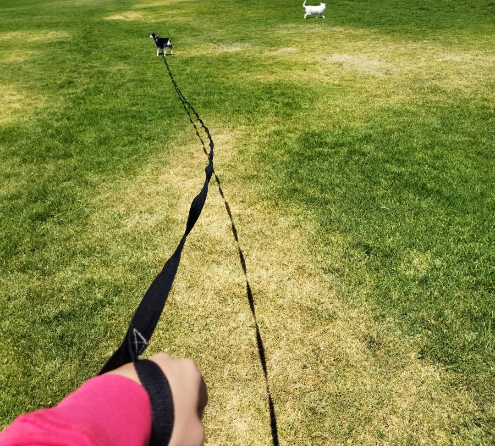
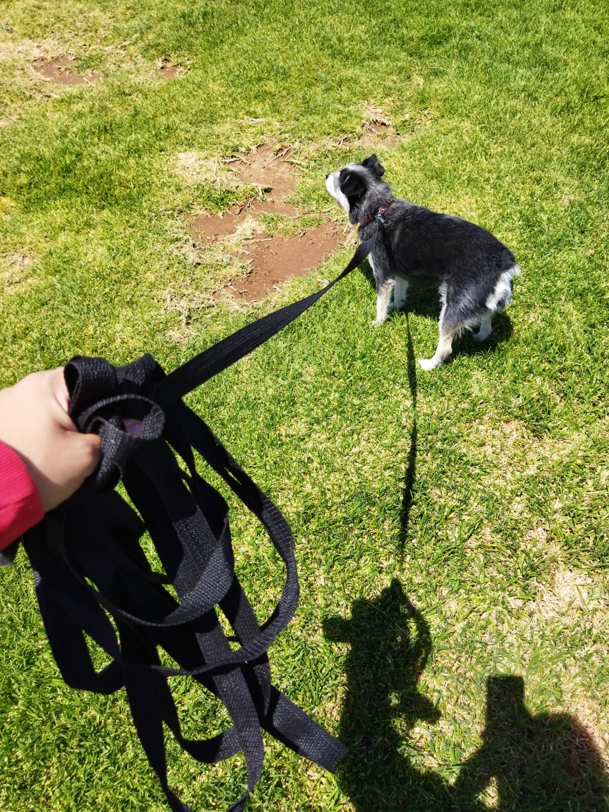
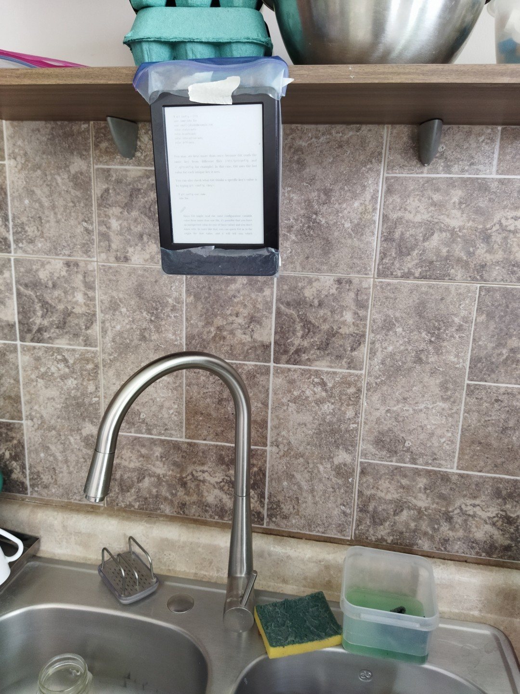

# Pretotypes

## "Are you building the right thing?"

---

### Main page

[https://rammasechor.github.io/](https://rammasechor.github.io/)

---

## Long distance fire starter

This idea was always in my mind; with the pandemic, I tend to shower around noon. My parents shower in the morning, and sometimes they turn off the water heater (like to save gas, but half of the time they forget to). Now, instead of changing my habits like a sane person and check the water heater before a shower, I keep getting undressed before turning on the shower; I always forget that the water heater may be off, and I need to get down, and turn it on. I want to create a device that can turn on the heater by itself; this device needs to be remote activated. I also need this to turn off the water heater when I want to. I know there are water heaters with this functionality already, but this would be like retrofitting an existing, old heater.

### Hypothesis

If I had the power to turn the water heater at will from any part of my house, I would use it fairly frequently. It also would help in saving gas if it can turn it off completely. This would indicate that it would be useful for more people.

### Experiment description

I set up a little piece of paper on my phone, and I asked my parents to turn off the water heater for the night for one night (they wouldn't agree to turn it off for more day's because of the hassle). I wrote a line on the paper each time I needed to turn on the heater when I already had water running.

### Validation

I tried this method myself for five days, and my parents once.

### Results

I put a line on the paper three (3) times of the four (4) days I ran this experiment (I remembered to check it on before on the fourth day). My parents needed to get down to turn it on in the morning, because they turn it on all the night so they don't need to do this in the morning; I think this device would help in saving gas. That day they also forgot to turn it off. But I would use it? Absolutely; My parents and I always forgot to turn it off after showering, and that's part of the problem. I don't know if they forgot to turn it off or not. This device would let me not worry about that. I think something like this would be very useful

## Super-leash

I have two dogs, one knows to walk without a leash (don't worry, she doesn't annoy other leashed dogs, or get down into oncoming cars), and the other doesn't. Sometimes she (the black one) wants to run with the other, but she has a leash, and can't go too far.

I want to create a long, long leash to let my dog run a little bit more.

### Hypothesis

People with dogs would use this long leash if it let's their dog be a little more happy running around.

### Experiment description

I created a long leash (I had some ribbon lying around and my mom has a sewing machine), and tested that leash with my black dog.

### Validation

I used this for four days straight, every time I took my dogs for a walk.

### Results

This was not a good idea:

- The leash is too long and it is a mess to carry around. It is still a leash, so you want to let go, or pick up the slack so that the leash is always a little bit tense.

- If I had a device to automatically pick up the slack, maybe it would work, but there is two problems with that:
  - This ribbon is not really suitable for retracting; it twists and makes a mess to untwist.
  - If I used something else, It would be a thin, strong rope so the device can retract it easily. But this is more dangerous, my dog could entangle itself and harm itself, or even the other dog, if it is in the path of the leash.

I wouldn't use this, and I think this would flop for the reasons stated above.

## Kindle mount

I want to create a mount that can change pages of a Kindle without the use of hands; like voice, or even movement activated. This would let me read while I do things with my hands that doesn't require my full attention; like washing the dishes.

### Hypothesis

If this mount really let's you integrate something you like (reading) with something boring (washing the dishes, for example), it would appeal to people, but only if it works seamlessly.

### Experiment description

I created a "mount"; this let's me read while I do the dishes.

### Validation

I used this each night for four days; one of my chores is to wash the dishes after dinner.

### Results

I think this may work: It let me read, and I really didn't feel like being stuck in a page, like when you're not paying attention, and your eyes just glide over the page.

The disadvantage was that it took me more than twice the time to wash the dishes; so from half an hour, I took like an hour and a quarter.

I think this may work with certain people, but that means that this would flop.

---

## All blogs

| Blog | Date |
| --- | --- |
| [Week 1 - Innovation and hard\smart work](/Week_Pages/Week1_April.md) | 05 Apr 2021 - 12 Apr 2021 |
| [Week 2 - Polyglot Programming](/Week_Pages/Week2_April.md) | 13 Apr 2021 - 19 Apr 2021 |
| [Week 3 - Fancy Topics](/Week_Pages/Week3_April.md) | 20 Apr 2021 - 26 Apr 2021 |
| [Week 4 - It's all about science](/Week_Pages/Week4_April.md) | 27 Apr 2021 - 03 May 2021 |
| [Month 1 - Reset Phase](/Month_Pages/Month1_April.md) | 27 Apr 2021 - 03 May 2021 |