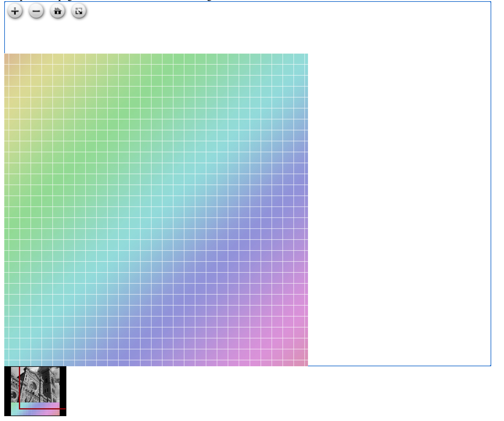
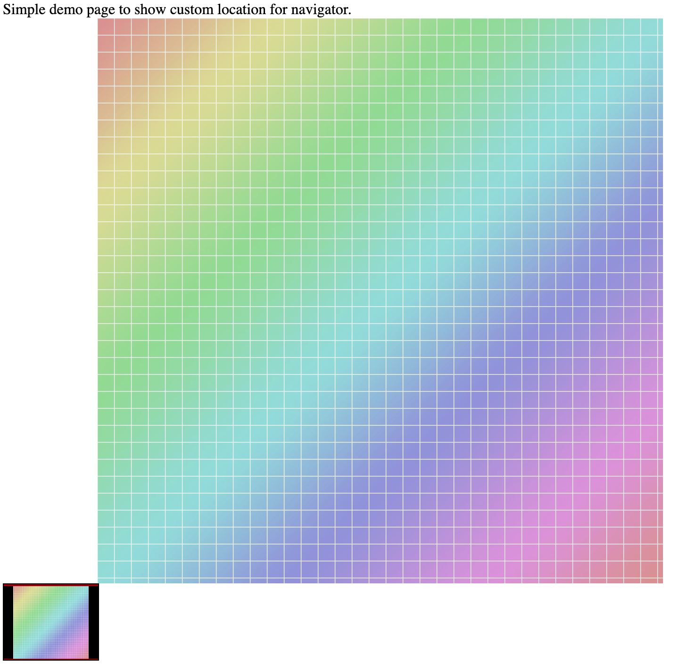

# Week 13 - Open source / Read others people's code (4)

## 29 Jun 2021 - 05 Jul 2021

---

### Main page

[https://rammasechor.github.io/](https://rammasechor.github.io/)

---

## OpenSeadragon contribution

### Inconsistency with setItemIndex and Navigator

[Link to issue](https://github.com/openseadragon/openseadragon/issues/1843)

### Context

OpenSeadragon is a web-based viewer for zoomable images, implemented in pure javascript. It is pretty simple, we have an image viewer that uses deconstructed images to avoid loading the full res image, but instead reconstructs each quadrant when zoomed. We can set callbacks for some events, like when we add an image to a view.

The issue is about setting the index of an image in the callback for when an image is added:

```js
viewer.world.addHandler('add-item', e => {
    viewer.world.setItemIndex(e.item, 0);
    console.log(viewer.world.getItemCount(e.item));
});

viewer.addTiledImage({
    tileSource: source,
});     
```

In this example, we always set the image we just added to the front of the array. The problem is that we can have another little view called `navigator`, that is like a mini-map for the image. That `navigator` has it's own `world`, separated from the main view, and when we try to set an index inside the callback, the `navigator`'s world hadn't had a chance to update; the method to set the index of an item also tried to set the index inside the navigator, but it can't find the item.

### Status

I have been trying to reproduce the original error mentioned in the issue, but it seems to be non-deterministic. I have been able to hit it a few times, but not consistently. With the code above I get another type of error, which is two assertions about an setting an index of an undefined item.

Hoping that those two error assertions were related to the error, I started to dive into the code. The expected behavior of the above code is to set any item that is added to the `0` index (so, behind all other items), however, the view in the navigator is not updated, since the world belonging to the navigator does not have the items updated at the moment of `setItemIndex`.

The code above has this behavior:


I can't get to output the original error message, but the behavior seems closely related to the discrepancy between the `world` of the `navigator` and the main view.

I have been able to fix this discrepancy, but I need to find a way to reproduce the original error to see if it is really fixed. This is the expected behavior:



I asked some questions in the original issue with my findings, and right now I'm waiting a little bit to see if there is any response.

## Topics for the interview

### SOLID principles

SOLID is an acronym for five design principles intended to make software designs more understandable, flexible and maintainable.

#### Single responsibility principle

Every module, class, or function in a computer program should have responsibility over a single part of the program's functionality, and it should encapsulate that part. This is also expressed as
>A class should have only one reason to change

It makes your software easier to implement, and prevents unexpected side effects of future changes.

This just means that you can make changes (refactor, maintain) to the code *without fear of breaking other things*. And it also makes your code easier to read.

One example is the classic *calculate-and-print*. You have a class which calculates some result, and also prints it. If you want to change the format of the printing, you need to change the class. But if you want to change the algorithm for the calculation, you also need to change that same class. A class should be responsible of one thing and one thing only.

#### Open-closed principle

> Software entities should be open for extension, but closed for modification

This principle was "refactored" to *The Polymorphic Open/Closed Principle*; it uses interfaces to achieve it's purpose.

And what is this purpose? The quote above means that a software entity has a *contract* with those who interact with it. This contract *should* be *closed* for modification, but the internal implementation *should* be *open* for extending it.

This is where interfaces enter. You define behavior within the interface, a set of methods that objects that implement that interface *will* have. But each object may implement it's own version of those methods. The interface *should* not change, but you may define new objects that implement that interface with new behavior.

#### Substitution principle

This is somewhat related to the open/closed principle; it defines that objects of a superclass shall be replaceable with objects of it's subclasses without breaking the application.

This means that implementations of an interface should be interchangeable in any call to the interface. For example, you would have a `transport` interface, and some implementations called `bike`, `car`, `legs`. You should be able to interchange any of these in a piece of code like this:

```js
var transport = new Car();
// Or...
var transport = new Bike();
// Or...
var transport = new Legs();
...
transport.go( destination );
```

This seem so obvious, but it is important to keep in mind. You may create code that relies on the implementation, but not the interface:

```js
var transport = new Legs();
...
transport.walk( destination );
```

You can't replace `new Legs()` with `new Car()` in this case. This piece of code is not reusable, and if `Legs` changes it's implementation of `walk()` it will break. Remember, modification to the interface is forbidden, but you may extend the implementation.

#### Interface segregation principle

This principle refers to the way we extend the interfaces. Remember, no modifying, but extending. Basically, we don't want objects depending on interface methods they don't use.

You have the interface `transport`. You may add a new implementation, `plane`. Since some implementations share details, you add `refuel()` to `transport`. After all, `car` refuels also, and in the case of `bike` or `legs`, you just implement it as:

```js
function refuel()   {
    throw new Exception("Can't refuel");
}
```

This is indeed wrong; `bike` and `legs` don't use `refuel()`, but somehow they depend from it in a sense. You should *segregate* two interfaces: `fuelTransport` and `selfMovingTransport`, and make them implement `transport`. Then, only `fuelTransport` has `refuel()` as method to override.

This complies with the substitution principle since you may use any object that implements `transport` in place of any object expected as `transport`, such as `fuelTransport` or `selfMovingTransport`, but not in reverse.

#### Dependency inversion principle

This principle is based on the open/closed and substitution principles. Basically, if you implement both of those principles, you're also implementing the dependency inversion principle.

You introduce an abstraction between high and low level modules; this enables the reusability of the high level modules by uncoupling them from the low level modules.

This has the effect of being able to change higher and low level components without changing other classes.

### Unit testing

#### What is it?

Is a software testing method by which individual units of source code are tested to determine whether they are fit for use. They are fit to use when they meet their design and work as intended. This test are typically automated.

A good practice is to isolate each unit being tested; if anything goes wrong, it is because that unit, and not because other component.

#### Why is it important?

Test code is it as important as production code. And this is because one simple reason: tests keep our code flexible. If you have tests, you don't fear making changes to the code. This ranges from performance fixes to readability refactoring.

Tests find problems early in the development cycle. They trace the source of the bug or failure with precision. They detect changes which may break a design contract.

#### Mocks, stubs, fakes

There is a subtle difference between stubs and fakes, and mocks. *Fakes* are objects that are almost the real deal; they have working implementations, but usually they take a shortcut which make them not suitable for production. *Stubs* provide canned answers to calls made during tests. Those types of objects are meant to be verified by means of their *state*: we determine whether the exercised method worked correctly by examining the state of the object after the call.

*Mocks* are programmed to expect certain method calls, which is called *behavior* verification: we check to see if we made the correct calls on the *mock* object.

#### Test Driven Development

TDD asks us to write unit tests, then code. There is three *rules* to guide us:

- You may no write production code until you have written a failing unit test.
- You may not write more of a unit test that is sufficient to fail, and not compiling is failing.
- You may not write more production code than is sufficient to pass the current failing test.

The tests and the production code are written together, with the tests just a few seconds ahead of the production code. If we work this way, we we will write dozens of tests every-month. Managing this is not easy, but worth the effort.

If the testing code is not clean, you may end up with more problems than with no testing code:

- More time consumed on managing the test code
- The tests are left alone because this unmanageability
- Old tests fail when code is refactored, and because the code is a mess, no one wants to refactor it

Code for tests should be held in the same regard as production code. The only thing that may be an exception is the performance. Since they only run in the developers machine, it may not be as fast (see next list).

Tests should be:

- Fast: May not be fast, but not slow. Slow tests are not ran.
- Independent: Should not depend on each other.
- Repeatable: Should be repeatable in any environment.
- Self-Validating: Should output a yes or no.
- Timely: Written just before the production code.

## Conclusions

This week I learned a lot about SOLID principles and Unit testing. I revisited some old weekly blogs about unit testing, and everything seems so clear now. Practicing with big codebases gave me a lot more experience I was expecting, and I did learn a lot from them. This week I worked on a javascript issue, and the maintainer actually answered! The last two open-source projects I worked on I did not get a response until I created a Draft Pull Request (and in one I'm still expecting the response to that Pull Request), but having someone that could answer some questions for me was really helpful. About some principles when writing code, I'm not 100% sold on the short function one, because I almost never see a short function in the codebases I have been working on. Oh well, I hope that when I'm working in a team I can ask about it.
