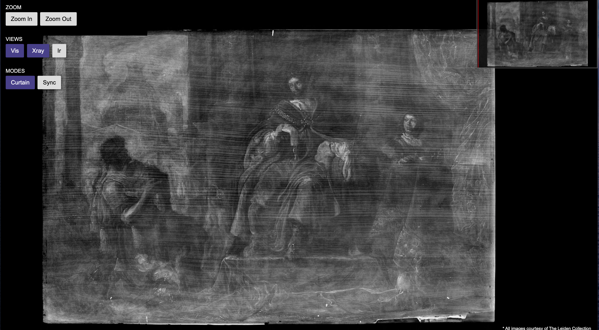

# Week 14 - Open source / Read others people's code (5)

## 06 Jul 2021 - 12 Jul 2021

---

### Main page

[https://rammasechor.github.io/](https://rammasechor.github.io/)

---

## Openseadragon contributions

### Add navigation keys to change image sources

[Link to issue](https://github.com/openseadragon/openseadragon/issues/1718)

#### Context

Openseadragon is an image viewer. You may have various images in the same viewer, but there is no keyboard shortcut to change between them, just UI buttons.

#### Status

I added the feature of changing image sources with keys: `j` (previous) and `k` (next). The maintainers deemed my change good, but asked me to fix something else related to the issue so they may bundle up with my pull request.

The fix was to integrate the functions used for changing sources into the main object of the file; before that change, the functions just were there, outside of the object.

I fixed that part, and seems good, but they asked me to change in how I call those methods now to be more inline of what is done usually. I fixed that, and now I'm just expecting a response from the maintainers.

[Link to pull request](https://github.com/openseadragon/openseadragon/pull/2007)

### Navigator mini-map resizes images when not intended

[Link to issue](https://github.com/openseadragon/openseadragon/issues/1831)

#### Context

The navigator (a little mini-map of the main image view) resizes its own images because it thinks an image has a different width after clipping that it really has.

In other words, it does not take into account the new width.

This is best shown with images:

- When the "curtain" is all the way to one side, the navigator shows the correct size (the navigator is the mini-map in the top right).

- But when we move the curtain, the navigator resizes the images in the view, because it thinks the clipped image width is it's start clipping point plus the original width.

- It also happens vertically

#### Status

The issue and the pull request are in different open source projects. This is because the root cause was not in the original project, but in a library that uses the original project. This fix seemed simple enough, but I did have to dive fairly deep into the code to realize that it was an issue of the other project.

The fixed behavior is this:

Notice how the mini-map now does not resize it's view.

[Link to pull request](https://github.com/cuberis/openseadragon-curtain-sync/pull/9)

## Topics for the interview

### Big O notation

Simplified analysis of an algorithms efficiency. It gives us the algorithms complexity in terms of input size. Machine independent.

### Common algorithms

#### Quicksort

Is an in-place sorting algorithm. This means that the input is overwritten by the algorithm. Quicksort works by dividing the array of values in two sub-arrays, in such a way that no element of the first sub-range is greater than any element from the second subrange. Then, quicksort recursively sorts the sub-arrays.

To achieve this, it uses a *pivot*. This pivot is a value that is position is final, and items to the left are smaller, and items to the right are larger.

The way we choose our pivot can affect performance, but there is no way to know until tested.

We take our pivot, and swap values on the left of our pivot if they are larger than the pivot *with* values on the right that are smaller than the pivot.

It has an average case of `O( n log n )`, and a worst case scenario of `O(nˆ2)` Worst case occurs when one of the subarrays returned is of size `n - 1`. This may occur when the pivot is the smallest or largest element in the list, because we need to traverse the entire list to compare, and if this is repeated, we reach `nˆ2`.

Quicksort has the advantage of `O(log n)` space complexity.

#### Mergesort

Is *not* an in place sorting algorithm. Divides recursively the array into smaller pieces; then, after we reach individual elements in the recursion, we re-integrate them in a sorted manner.

It has a `O(n log n)` average and worst case scenario, and a space complexity of `O(n)`.

#### Heapsort

It is a in-place algorithm. It works by creating a *heap*, then, since the root of the heap is always the greater value, it sends it to the back, and removes it from the heap. Then, it *heapifies* the structure left to create another heap. This puts the greater value of the remaining values at the top again, and the cycle continues.

It has a `O(n log n)` average and worst case scenario, and a space complexity of `O(n)`.

#### Counting sort

This method sorts the values checking for the number of *places* the values before it occupy. It works best when the range of the values is very small. It has a worst case scenario of `O(n + k)`, where *k* is the range of the values.

### Some thoughts on algorithm complexity

The fastest sorting algorithm is the one that exploits the peculiarities of the data on the hardware, subject to your external constraints.

The second-fastest algorithm is the one in the good enough library that you didn't have to write.

Always make sure the algorithm it actually a bottleneck before getting fancy.

### Search algorithms

#### Linear search

Method for finding an element within a list. It sequentially checks each element of the list until a match is found, or the whole list has been searched.

It has a worst case of `O(n)`, and an average case of `O(n/2)`.

#### Binary search

Finds the position of a target value within a **sorted array**. Compares the target value to the middle of the array, and if not equal, it goes to the half part of the array that is expected to have the target.

It has a worst case of `O(log n)` and a average case of `O(log n)`.

#### Breadth-first search

This type of search applies to trees. It starts at the tree root and explores all the nodes at the current depth before moving on the next depth level.

This type of search is also used to traverse a tree.

#### Depth-first search

Applies to trees. Starts at the root, and explores as far as possible along each branch before backtracking.

Also used to traverse trees.

### Object Oriented Programming

#### Inheritance

Is the mechanism of basing an object upon another object, retaining similar implementation. An inherited class is called a *subclass* of its parent/super class.

Inheritance should not be confused with subtyping. Subtyping establishes a *is-a* relationship, whereas inheritance only reuses implementation. Subtyping is known as *interface inheritance*, whereas inheritance is defined as *implementation inheritance* or *code inheritance*.

Subtyping is a type of polymorphism. Inheritance is more about reusing code.

#### Polymorphism

Is the provision of a single interface to entities of different types, or the use of a single symbol to represent multiple different types.

For example, the classic example of `shape`. We make `circle` and `square` implement interface `shape`. `shape` has a method called `draw()`. Now, when we call `var s = new ...(), s.draw()`, we don't care if it is a `circle` or a `square`, only that it is a `shape`.

We can use subtypes interchangeably.

#### Abstraction

Handle complexity by hiding unnecessary details from the user. This enables the user to implement more complex logic on top of the provided abstraction without understanding or even thinking about the hidden complexity.

We take the details important to us, and leave the rest.

#### Encapsulation

Bundling of data with the methods that operate in that data, or restricting the direct access to some of an object's components. Public accessible methods are generally provided in the class to access or modify the state more abstractly.

This is to adhere to the contracts of an object obtain with the ones that interact with it via its interface. Changing a variable of an object directly can lead to the object thinking it is in another state than the current one.

#### Class

Is an extensible program-code-template, providing initial values for state (member variables) and implementations of behavior (methods). When an object is created by a constructor of the class, the resulting object is called an instance of the class, and the member variables specific to the object are called instance variables. A `static` variable in a class is called a class variable.

#### Abstract Class and Interfaces

Abstract Classes are Classes that cannot be instantiated. They may contain a mix of methods declared with or without an implementation. And here is the kick; they may define public, protected, and private variables/methods.

With interfaces, all fields are automatically public, static, and final, and all methods are public.

You can extend only one class, but you can implement more than one interface.

Why use one or the other? Consider abstract classes for:

- Share code among closely related classes. This also has the benefit of no duplication.
- Expect classes that extend the abstract class have many common methods or fields.
- Declare non static or non final fields.

Consider interfaces for:

- Unrelated classes implement the interface
- Specify the behavior, but not concerned about who implements it.
- Multiple inheritance.

### Design Patterns

Is a general, reusable solution to a commonly occurring problem in software design. Is a description, or a template for how to solve a problem that can be used in many different situations.

#### Creational patterns

Design patterns that deal with object creation mechanisms.

- Factory: Decouples the creation of objects. You call a factory method instead of calling a constructor. This just means that a class is in charge of instantiating new objects, and you tell that class which kind of object you want. Those objects must implement the same interface.
- Abstract Factory: Same as factory, but it is a factory of *factories*. You tell the abstract factory what type of factory you want. For example, you create a factory of furniture (which is the above pattern), and a factory that creates factories of furniture.
- Builder: Construct complex objects step by step. Instead of passing a bunch of parameters into a constructor, or adding items after, you create a class that *builds* that object via a series of calls to that class. At the end there is a call to get the result.
- Prototype: You want a copy of an object. But that object may have private methods and classes, and copying makes that `copy` method depend on the class. You instead delegate the `copy` method into that object, so that that same objects creates a copy.
- Singleton: Ensures a class has only one instance. You can't instantiate new objects; only a static method returns the only object created of that type.

#### Structural Pattern
